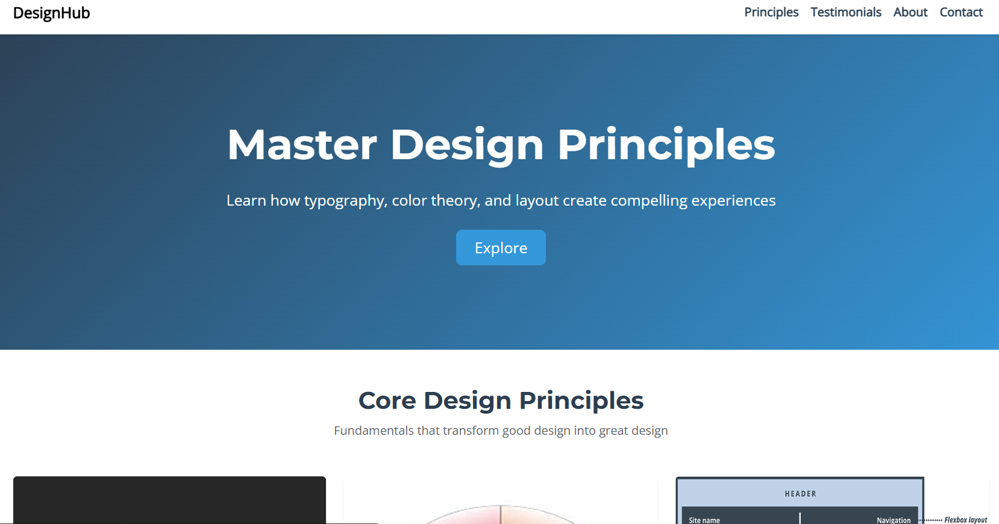

# DesignHub Landing Page

A responsive single-page website showcasing core design principles (typography, color theory, and layout) built with Bootstrap 5.

## Features

✅ **Modern Design**  
- Clean, professional layout with proper whitespace  
- Complementary color scheme based on color theory  
- Typography hierarchy with Google Fonts pairing  

✅ **Interactive Elements**  
- Smooth scrolling navigation  
- Hover animations on cards and buttons  
- Testimonial carousel  

✅ **Responsive Layout**  
- Mobile-first CSS approach  
- Bootstrap 5 grid system  
- Media queries for all device sizes  

## Technologies Used

- **Frontend**: HTML5, CSS3, JavaScript  
- **Framework**: [Bootstrap 5](https://getbootstrap.com/)  
- **Icons**: [Bootstrap Icons](https://icons.getbootstrap.com/)  
- **Fonts**: [Google Fonts](https://fonts.google.com/) (Montserrat + Open Sans)  

## File Structure
designhub-landing-page/
├── index.html
├── styles.css
├── script.js
├── assets/
│ ├── typography.jpg
│ ├── colors.jpg
│ ├── layout.jpg
│ ├── client1.jpg
│ └── client2.jpg
└── README.md

## Installation

1. Clone the repository:
git clone https://github.com/yourusername/designhub-landing-page.git

2. Open in your browser:
Simply open index.html in any modern browser

Customization
To modify the content:

Update text in index.html

Replace images in /assets folder (keep same filenames)

Adjust colors in styles.css (edit CSS variables)

License
This project is licensed under the MIT License - see the LICENSE file for details.

